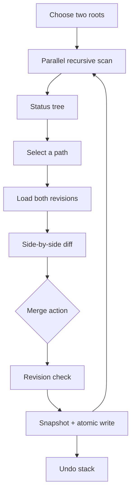

# Architecture

## Why this is a companion app

Folder Diff uses Zed's technology stack, but does not run inside Zed. GPUI supplies the native window and element tree; the comparison and merge engines are ordinary Rust modules.

The separation is deliberate. Zed's public extension API is suited to languages, themes, slash commands, context servers, and external tools, but it does not expose a general custom-view or filesystem-merge API. The companion can therefore provide the complete directory-comparison workflow today without patching Zed itself.

## Modules

| Module | Responsibility |
| --- | --- |
| `app` | GPUI state, native folder pickers, tree/diff rendering, background jobs, merge confirmations |
| `scanner` | Standard-library traversal/workers, ignores, SHA-256, binary detection, status classification, safe preview loading |
| `diff` | Internal Myers line blocks, unchanged-region grouping, byte ranges, hunk application, word-segment utility |
| `merge` | Standard-library transaction snapshots, atomic file writes, copy/sync, rollback, undo, symlink defenses |
| `config` | Dependency-free persistent roots and comparison settings in macOS Application Support |
| `zed` | Zed CLI discovery and `zed --diff` process launch |
| `model` | Shared domain types |

## Data flow

Directory scans and previews run on GPUI's background executor. The scanner uses scoped standard threads for filesystem comparison; results return to the foreground entity before state is mutated and a new frame is requested.

## Comparison rules

The scanner walks both roots without following symlinks. It indexes paths relative to each selected root, unions the indexes, and compares paths on scoped standard-library worker threads.

- Files are equal when their SHA-256 revisions match.
- When configured, small UTF-8 files can also be equal after line-ending or whitespace normalization.
- Symbolic links compare their link targets, never the referents.
- Directory entries are structural only and do not appear as file differences unless the other side has a different filesystem type.
- Preview rendering is limited to 2 MiB per side; larger and binary files can still be copied as a whole.

## Merge invariants

- Every application-controlled path is joined with `safe_join`, which rejects absolute paths and parent traversal.
- Interactive copy source and destination revisions must match the revisions captured by the preview. A missing destination must still be missing.
- Destination parent components may not be symlinks.
- A directory is never removed or overwritten.
- A transaction captures a destination at most once, even when a bulk operation encounters the same path repeatedly.
- A failed transaction restores snapshots in reverse order.
- Bulk synchronization copies source-side modified/source-only paths; it never removes target-only paths.

## Future work

- Editable ignore-pattern list and `.gitignore` import.
- Syntax highlighting using tree-sitter language grammars.
- Word-level styling in changed lines (the segmentation utility already exists).
- Signed/notarized installers and automatic updates.
- A future in-Zed front end if the extension API gains custom GPUI views and filesystem permissions.
